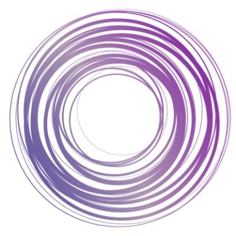

# TornadoVM

### Write Java. Run on Any GPUs.

TornadoVM is a GPU programming framework for Java that just works with any modern JDK. It JIT-compiles Java bytecode into **OpenCL C, CUDA PTX, SPIR-V, and Apple Metal (MSL)** at runtime, so your existing Java code runs on NVIDIA, AMD, Intel, and Apple Silicon GPUs, integrated GPUs, FPGAs, and multi-core CPUs. No CUDA C. No JNI bindings to maintain. No native toolchain in your application.

[](https://github.com/beehive-lab/TornadoVM/actions/workflows/build-test-jdk21.yml)
[](https://github.com/beehive-lab/TornadoVM/actions/workflows/build-test-jdk25.yml)
[](https://central.sonatype.com/artifact/io.github.beehive-lab/tornado-api)
[](https://sdkman.io/sdks/tornadovm/)
[](https://tornadovm.readthedocs.io/en/latest/)
[](https://join.slack.com/t/tornadovmcommunity/shared_invite/zt-3ai2wyqva-bKz~cQRFlaJ~ZnPrbkwIEw)

**Latest release:** TornadoVM 4.0.1 (JDK 21 / JDK 25) — now with a native **Apple Metal backend** for Apple Silicon. [Changelog](https://tornadovm.readthedocs.io/en/latest/CHANGELOG.html) · [Website](https://www.tornadovm.org) · [Documentation](https://tornadovm.readthedocs.io/en/latest/)


---

## This is the whole programming model

Write the kernel in Java with the same thread-indexing model you'd use in CUDA — then build a task graph and execute. TornadoVM JIT-compiles the bytecode to a GPU kernel at runtime and manages all host↔device data transfers for you.

<table>
<tr>
<th>Java + TornadoVM (Kernel API)</th>
<th>The same kernel in CUDA C</th>
</tr>
<tr>
<td>

```java
void mxv(KernelContext ctx,
         FloatArray m,
         FloatArray v,
         FloatArray out,
         int rows, int cols) {
  int i = ctx.globalIdx;
  if (i < rows) {
    float sum = 0f;
    for (int j=0; j<cols; j++)
      sum += m.get(i*cols+j)*v.get(j);
    out.set(i, sum);
  }
}

// TornadoVM auto-manages device
// memory + kernel dispatch via a
// TaskGraph — no host plumbing,
// runs unchanged on all 4 backends.
```

</td>
<td>

```c
__global__ void mxv(
    const float *m,
    const float *v,
    float *out,
    int rows, int cols) {
  int i = blockIdx.x*blockDim.x
        + threadIdx.x;
  if (i < rows) {
    float sum = 0.f;
    for (int j=0; j<cols; j++)
      sum += m[i*cols+j]*v[j];
    out[i] = sum;
  }
}

// ...and on the host you STILL write:
//   cudaMalloc/cudaMemcpy per buffer
//   grid/block dims, launch, sync
//   cudaMemcpy back, then cudaFree
//   nvcc build + per-GPU binaries
//   + a rewrite for non-NVIDIA GPUs
```

</td>
</tr>
</table>


<details>
<summary><h3>…and the host side — wrap data, map a thread grid, execute (click to expand)</h3></summary>

```java
// TornadoVM off-heap arrays (flat, row-major)
FloatArray m   = new FloatArray(rows * cols);
FloatArray v   = new FloatArray(cols);
FloatArray out = new FloatArray(rows);
// ...fill m and v...

KernelContext ctx  = new KernelContext();
WorkerGrid worker  = new WorkerGrid1D(rows);
GridScheduler grid = new GridScheduler("compute.mxv", worker);

TaskGraph tg = new TaskGraph("compute")
    .transferToDevice(DataTransferMode.FIRST_EXECUTION, m, v)
    .task("mxv", Kernels::mxv, ctx, m, v, out, rows, cols)
    .transferToHost(DataTransferMode.EVERY_EXECUTION, out);

try (TornadoExecutionPlan plan = new TornadoExecutionPlan(tg.snapshot())) {
    plan.withGridScheduler(grid).execute();   // JIT-compiled to your GPU
}
```

</details>


`KernelContext` gives you the full GPU programming model — global/local thread IDs, local memory, and barriers, the same semantics as CUDA/OpenCL/SYCL — while TornadoVM handles memory management and runs the *identical* code across all four backends. Don't need that control? Drop `KernelContext` and just annotate the loop with `@Parallel` — TornadoVM infers the thread mapping for you. Both styles combine in the same `TaskGraph`. [Programming guide →](https://tornadovm.readthedocs.io/en/latest/programming.html)

Beyond JIT compilation, the runtime provides features unique in the Java space: **dynamic reconfiguration** (live task migration between devices at runtime), **batch processing** for datasets larger than device memory, **multi-device / multi-backend** concurrent execution, and a built-in **profiler**.

---

## What people build with it

| Project | What it shows |
|---|---|
| 🦙 [**GPULlama3.java**](https://github.com/beehive-lab/GPULlama3.java) | LLM inference (Llama 3, Qwen 3, Mistral, Phi-3, Granite, DeepSeek distills) in pure Java — **117 tok/s on an RTX 5090**, official GPU engine for [LangChain4j](https://docs.langchain4j.dev/integrations/language-models/gpullama3-java) and [Quarkus](https://docs.quarkiverse.io/quarkus-langchain4j/dev/gpullama3-chat-model.html) |
| 🔆 [**TornadoVM-Ray-Tracer**](https://github.com/Vinhixus/TornadoVM-Ray-Tracer) | Real-time ray tracing in Java, interactive frame rates on consumer GPUs |
| 📷 [**kfusion-tornadovm**](https://github.com/beehive-lab/kfusion-tornadovm) | KinectFusion 3D reconstruction — a full computer-vision pipeline on integrated and discrete GPUs |

TornadoVM is used to accelerate machine learning and deep learning, computer vision, physics simulations, financial applications, computational photography, and signal processing. Building something with TornadoVM? [Tell us](https://github.com/beehive-lab/TornadoVM/discussions) — we feature community projects.

<!-- TODO: add a "Used in production by" line once 2–3 adopters agree to be named -->

---

## ⚡ Quick start

### Prerequisites

- **JDK 25** (or GraalVM based on JDK 25) — `JAVA_HOME` must point to it
- GCC/G++ ≥ 13, plus the driver for your target (OpenCL runtime, CUDA Toolkit, Level Zero, or macOS for Metal)

### Install via SDKMAN!

```bash
sdk install tornadovm
```

Pick a backend-specific build if you prefer a smaller install:

| Backend | SDKMAN! version | Targets |
|---|---|---|
| OpenCL *(default)* | `4.0.0-opencl` | NVIDIA / AMD / Intel GPUs, multi-core CPUs, FPGAs |
| PTX | `4.0.0-ptx` | NVIDIA GPUs (CUDA) |
| SPIR-V | `4.0.0-spirv` | Intel GPUs (Level Zero / oneAPI) |
| Metal 🆕 | `4.0.0-metal` | Apple Silicon GPUs (M1–M4), natively via MSL |
| All backends | `4.0.0-full` | Everything above |

Binaries are also on the [official website](https://www.tornadovm.org/downloads). For [Docker](https://github.com/beehive-lab/docker-tornado#docker-for-tornadovm) and [AWS (CPUs/GPUs/FPGAs)](https://tornadovm.readthedocs.io/en/latest/cloud.html) see the linked guides.

### Verify your devices

```bash
tornado --devices
```

### Run your first program

```bash
# Unix (Linux/macOS)
java @$TORNADOVM_HOME/tornado-argfile \
  -cp $TORNADOVM_HOME/share/java/tornado/tornado-examples-2.2.0.jar \
  uk.ac.manchester.tornado.examples.compute.MatrixVectorRowMajor

# Windows 10+
java @%TORNADOVM_HOME%\tornado-argfile ^
  -cp %TORNADOVM_HOME%\share\java\tornado\tornado-examples-2.2.0.jar ^
  uk.ac.manchester.tornado.examples.compute.MatrixVectorRowMajor
```

More examples — NBody, DFT, KMeans, matrix kernels, reductions: [tornado-examples](tornado-examples/src/main/java/uk/ac/manchester/tornado/examples)

---

## 📦 Use TornadoVM in your project

```xml
<dependencies>
  <dependency>
    <groupId>io.github.beehive-lab</groupId>
    <artifactId>tornado-api</artifactId>
    <version>4.0.1-jdk25</version>
  </dependency>
  <dependency>
    <groupId>io.github.beehive-lab</groupId>
    <artifactId>tornado-runtime</artifactId>
    <version>4.0.1-jdk25</version>
  </dependency>
</dependencies>
```

---

## ❓ FAQ

<details>
<summary><b>How does TornadoVM relate to OpenJDK's Project Babylon / HAT?</b></summary>

[Project Babylon](https://openjdk.org/projects/babylon/) is OpenJDK's exploratory work on code reflection, with HAT (Heterogeneous Accelerator Toolkit) as a research vehicle for GPU programming. We think it validates the direction TornadoVM has pursued since 2018 — and the projects are complementary rather than competing. The practical difference today: **TornadoVM is usable now**, with four production backends (OpenCL, PTX, SPIR-V, Metal), FPGA support, a profiler, dynamic reconfiguration, Maven Central artifacts, and years of hardening across vendor hardware — and it runs on standard JDK 21/25 releases. We follow Babylon closely and expect the ecosystems to converge over time.
</details>

<details>
<summary><b>What's the licensing situation for commercial use?</b></summary>

The parts your application links against — **Tornado-API** and all the modules you code with — are **Apache 2.0**. The runtime and drivers are **GPLv2 with Classpath Exception**, the same license as OpenJDK itself: it does not impose copyleft obligations on your application, exactly as running on OpenJDK doesn't. Full per-module breakdown [below](#licenses-per-module).
</details>

<details>
<summary><b>Does it replace my JVM?</b></summary>

No. TornadoVM is a plug-in to your existing OpenJDK or GraalVM installation. It complements the JVM with the ability to offload selected tasks to accelerators, handling device memory management and kernel orchestration. Everything else in your application runs on the JVM as normal.
</details>

<details>
<summary><b>Which hardware is supported?</b></summary>

Multi-core CPUs; dedicated GPUs from NVIDIA, AMD, and Intel; integrated GPUs (Apple Silicon M1–M4, Intel HD Graphics, ARM Mali); and FPGAs from Intel and Xilinx. Backends can be installed individually or together, and tasks can migrate between devices at runtime.
</details>

<details>
<summary><b>How fast is it?</b></summary>

It depends on the workload — data-parallel kernels with enough arithmetic intensity see order-of-magnitude speedups over sequential Java; see the [benchmarking guide](https://tornadovm.readthedocs.io/en/latest/benchmarking.html) and the [GPULlama3.java performance tables](https://github.com/beehive-lab/GPULlama3.java#-performance) for end-to-end numbers on real applications.
</details>

---

## 🤝 Contributing & community

- 💬 Questions and ideas: [GitHub Discussions](https://github.com/beehive-lab/TornadoVM/discussions) or the [TornadoVM Slack](https://join.slack.com/t/tornadovmcommunity/shared_invite/zt-3ai2wyqva-bKz~cQRFlaJ~ZnPrbkwIEw)
- 🛠️ Building from source: [INSTALL_FROM_SOURCE.md](INSTALL_FROM_SOURCE.md)
- 📋 How to contribute: [CONTRIBUTING.md](CONTRIBUTING.md) · [`good first issue`](https://github.com/beehive-lab/TornadoVM/issues?q=is%3Aissue+is%3Aopen+label%3A%22good+first+issue%22)
- 🤖 Working with an AI coding agent? The repo ships a [TornadoVM developer skill](tornadovm-skill.skill) (build, test, debug workflows) for Claude.
- 🏛️ Academic & industrial collaborations: [contact us](https://www.tornadovm.org/contact-us)

---

## 📚 Resources & publications

Videos, presentations, and articles: [resources](https://tornadovm.readthedocs.io/en/latest/resources.html). Selected academic publications: [publications](https://tornadovm.readthedocs.io/en/latest/publications.html).

If you use **TornadoVM ≥ 0.2** in research, please cite:

```bibtex
@inproceedings{Fumero:DARHH:VEE:2019,
 author    = {Fumero, Juan and Papadimitriou, Michail and Zakkak, Foivos S. and
              Xekalaki, Maria and Clarkson, James and Kotselidis, Christos},
 title     = {{Dynamic Application Reconfiguration on Heterogeneous Hardware}},
 booktitle = {Proceedings of the 15th ACM SIGPLAN/SIGOPS International
              Conference on Virtual Execution Environments},
 series    = {VEE '19},
 year      = {2019},
 doi       = {10.1145/3313808.3313819},
 publisher = {Association for Computing Machinery}
}
```

For **Tornado 0.1** (initial release), cite [Clarkson et al., ManLang '18](https://doi.org/10.1145/3237009.3237016).

## Licenses per module

Link the **Tornado-API** (Apache 2.0) into your application.

| Modules | License |
|---|---|
| Tornado-API, Tornado-Assembly, Tornado-scripts, Tornado-Annotation, Tornado-Unittests, Tornado-Benchmarks, Tornado-Examples, Tornado-Matrices, Tornado-Drivers-OpenCL-Headers | [Apache 2.0](LICENSE_APACHE2) |
| Tornado-Runtime, Tornado-Drivers | [GPLv2 with Classpath Exception](LICENSE_GPLv2CE) |

## Acknowledgments

Partially funded by [Intel Corporation](https://www.intel.com/) and by EU & UKRI grants (most recent first): [AERO](https://aero-project.eu/) (101092850), [P2CODE](https://p2code-project.eu/) (101093069), [ENCRYPT](https://encrypt-project.eu) (101070670), [TANGO](https://tango-project.eu) (101070052), [ELEGANT](https://www.elegant-h2020.eu/) (957286), [E2Data](https://e2data.eu) (780245), [ACTiCLOUD](https://acticloud.eu) (732366); and EPSRC grants [PAMELA](http://apt.cs.manchester.ac.uk/projects/PAMELA/) (EP/K008730/1) and [AnyScale Apps](https://gow.epsrc.ukri.org/NGBOViewGrant.aspx?GrantRef=EP/L000725/1) (EP/L000725/1).

Meet the [team](https://www.tornadovm.org/about-us).
