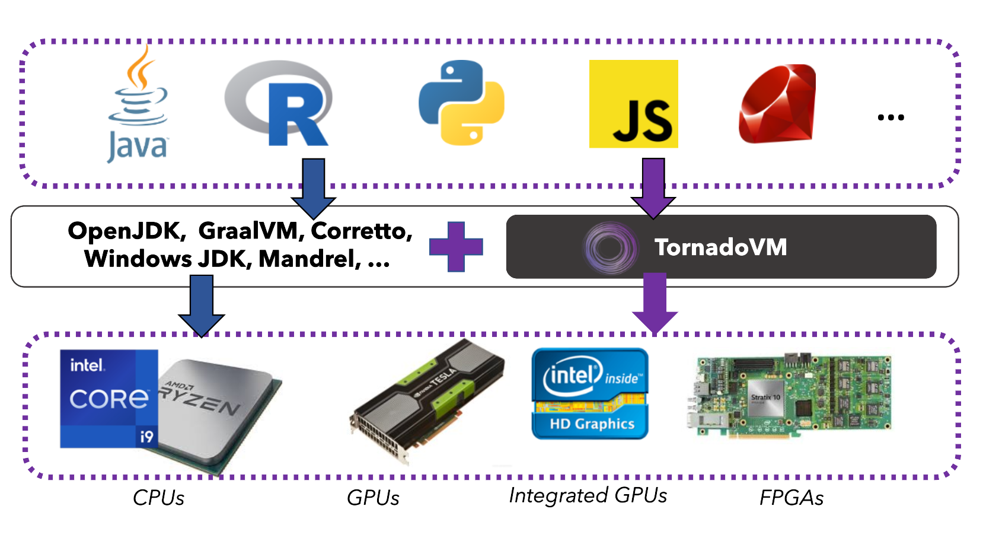
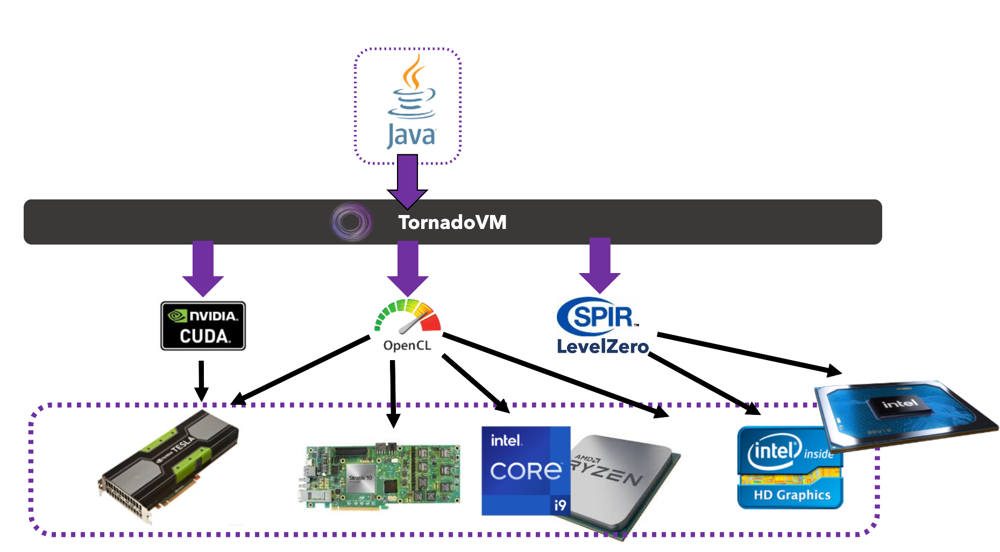

Introduction to TornadoVM
=========================

TornadoVM is a plug-in to OpenJDK and other JDK distributions (e.g., GraalVM, Red Hat Mandrel, Amazon Corretto, Microsoft OpenJDK, Azul Zulu) 
that allows developers to automatically offload and run a subset of Java programs on heterogeneous hardware. 
TornadoVM targets devices compatible with OpenCL, NVIDIA PTX, and Level-Zero, which include multi-core CPUs (Intel and AMD),
dedicated GPUs (Intel, NVIDIA, AMD), integrated GPUs (Intel HD Graphics, Apple M1/M2/M3, and ARM Mali), and FPGAs (Intel and Xilinx).

TornadoVM currently has three backends:
It compiles Java code, at runtime, from Java bytecode to OpenCL C, NVIDIA CUDA PTX, and SPIR-V binary.
Developers can choose which backend/s to install and run.

TornadoVM does not replace existing VMs, but it rather complements them with the capability of offloading Java code to OpenCL, PTX and SPIR-V,
handling memory management between Java and hardware accelerators, and running/coordinating the compute-kernels.

Main Features
--------------------------

TornadoVM includes the following features:

-   **Hardware agnostic APIs:** The APIs are hardware agnostic, which means that, from the developers' view, the source code is exactly the same for CPUs, GPUs and FPGAs. It is the TornadoVM runtime and the TornadoVM JIT Compiler that specialises the code per architecture.
-   **Optimising Just In Time (JIT) compiler per device architecture:** This means that the code is specialised per architecture (e.g., the GPU generated code is specialised differently compared to FPGAs and CPUs).
-   **Live task migration:** this means that TornadoVM can migrate, at runtime, tasks from one accelerator to another (e.g., from CPU to the GPU).
-   **Batch processing:** TornadoVM can partition datasets to process in batches on devices that has less physical memory than the main device (CPUs).
-   **Deployable from edge to cloud:** TornadoVM can be deployed on low-power device (e.g., NVIDIA Jetson Nano), Desktop PCs, servers and data centers.
-   **Containers:** TornadoVM can be used within Docker containers for running on NVIDIA GPUs, Intel CPUs and Intel GPUs.

TornadoVM is a research project in active development created under the `APT Group <https://apt.cs.manchester.ac.uk/>`_ at `The University of Manchester <https://www.manchester.ac.uk/>`_.