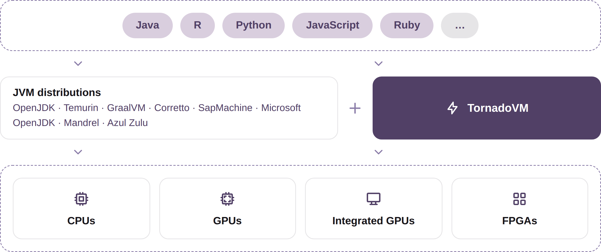
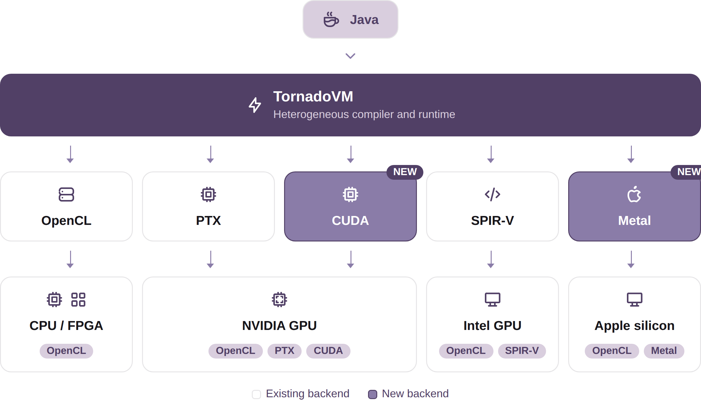

Introduction to TornadoVM
=========================

.. image:: images/tornadovm-logo.png
  :width: 300
  :alt: TornadoVM logo
  :align: left

TornadoVM is a plug-in to OpenJDK and other JDK distributions (e.g., GraalVM, SapMachine, Temurin, Red Hat Mandrel, Amazon Corretto, Microsoft OpenJDK, Azul Zulu)
that allows developers to automatically offload and run a subset of Java programs on heterogeneous hardware.
TornadoVM targets devices compatible with OpenCL, PTX, CUDA, and Apple Metal, which include multi-core CPUs,
dedicated GPUs, integrated GPUs, and FPGAs from multiple vendors.

TornadoVM compiles Java code, at runtime, from Java bytecode to OpenCL C, PTX, CUDA C
(compiled to PTX via NVRTC), and Metal Shading Language.
Developers can choose which backend/s to install and run.

TornadoVM does not replace existing VMs, but it rather complements them with the capability of offloading Java code to OpenCL, PTX, CUDA and Metal,
handling memory management between Java and hardware accelerators, and running/coordinating the compute-kernels.

Main Features
--------------------------

TornadoVM includes the following features:

-   **Hardware agnostic APIs:** The APIs are hardware agnostic, which means that, from the developers' view, the source code is exactly the same for CPUs, GPUs and FPGAs. It is the TornadoVM runtime and the TornadoVM JIT Compiler that specialises the code per architecture. To express parallelism within a method, developers use either the :ref:`Loop Parallel API <loop-parallel-api>` (Java annotations such as ``@Parallel``, recommended for non-experts) or the lower-level :ref:`Kernel API <kernel-context-api>` (``KernelContext``, for developers who want explicit control over thread IDs, local memory and barriers). Methods prepared with either API are then grouped and orchestrated with the :ref:`Task-Graph API <task-graph-api>` together with the :ref:`TornadoExecutionPlan <execution-plan>`: the ``TaskGraph`` defines *what* to run (the data movement and the methods to accelerate), while the ``TornadoExecutionPlan`` defines *how* to run it on the target device (e.g., with the profiler enabled, with batch processing enabled, on a specific device, etc.).
-   **Optimising Just In Time (JIT) compiler per device architecture:** This means that the code is specialised per architecture (e.g., the GPU generated code is specialised differently compared to FPGAs and CPUs).
-   **Batch processing:** TornadoVM can partition datasets to process in batches on devices that has less physical memory than the main device (CPUs).
-   **Deployable from edge to cloud:** TornadoVM can be deployed on low-power device (e.g., NVIDIA Jetson Nano), Desktop PCs, servers and data centers.
-   **Containers:** TornadoVM can be used within Docker containers for running on NVIDIA GPUs, Intel CPUs and Intel GPUs.
-   **Native NVIDIA library integration:** on NVIDIA GPUs, TornadoVM calls directly into cuBLAS, cuFFT and cuDNN, and exposes Tensor Core ``mma.sync`` intrinsics from Java (see :ref:`hybrid-api`).

TornadoVM is a research project in active development created under the `APT Group <https://apt.cs.manchester.ac.uk/>`_ at `The University of Manchester <https://www.manchester.ac.uk/>`_.